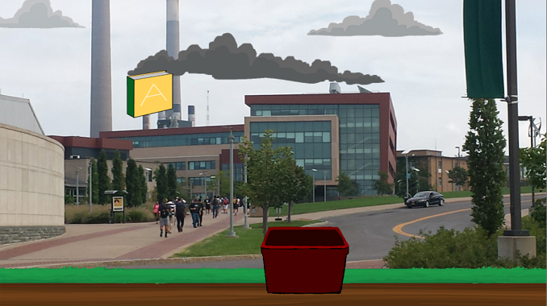

# OswegoDebtCatch-Complete
Simple fun game to be used as an intro to making games with unity engine.
When the game starts, the player has "debt" of 50000, and the game lasts 30 seconds.
During that time, the player controls the basket to catch the books falling from the sky.
Books with the label "A" decrease the player's debt, while books with the label "F" 
increase the player's debt.
Below is a screen shot of the game. Note the awesome oswego **Colors**

